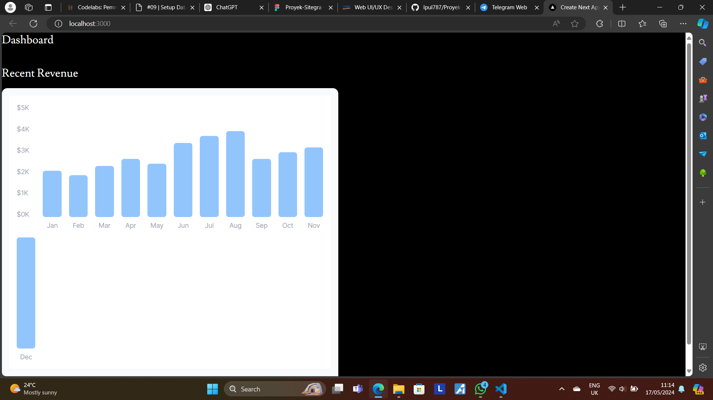
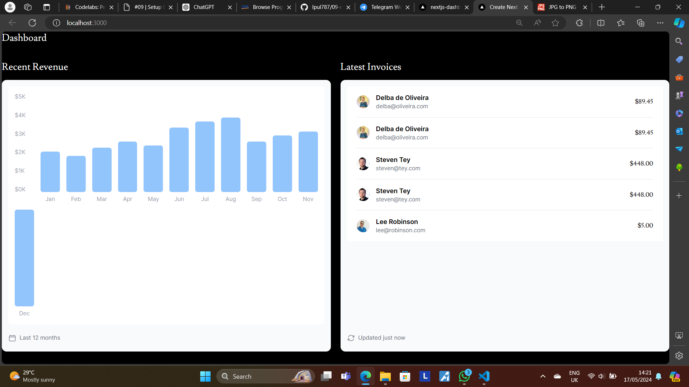
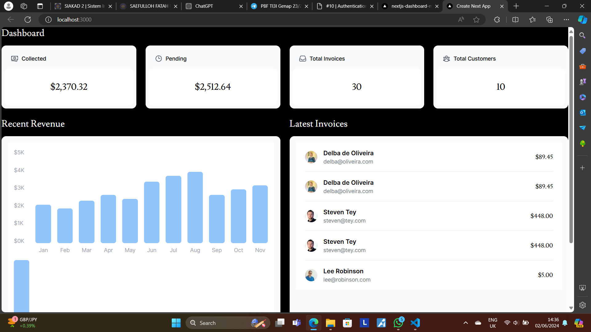
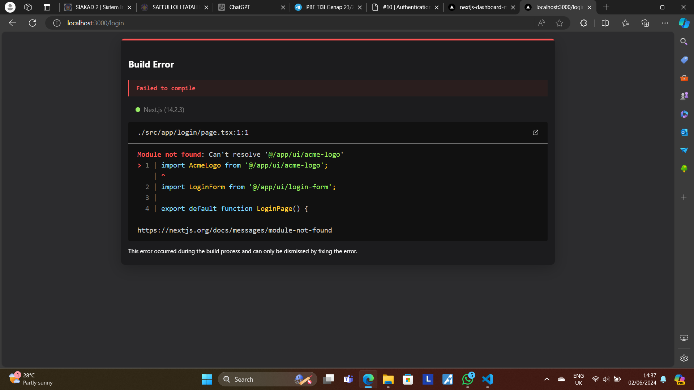

This is a [Next.js](https://nextjs.org/) project bootstrapped with [`create-next-app`](https://github.com/vercel/next.js/tree/canary/packages/create-next-app).

## Getting Started

First, run the development server:

```bash
npm run dev
# or
yarn dev
# or
pnpm dev
# or
bun dev
```

Open [http://localhost:3000](http://localhost:3000) with your browser to see the result.

You can start editing the page by modifying `app/page.tsx`. The page auto-updates as you edit the file.

This project uses [`next/font`](https://nextjs.org/docs/basic-features/font-optimization) to automatically optimize and load Inter, a custom Google Font.

## Practicum Report Week 8

|  | Framework Based Programming 2024 |
|--|--|
| NIM |  2141720067|
| Nama |  Saefulloh Fatah Putra Kyranna |
| Kelas | TI - 3I |

## Answer of Question No. 1

Output of Deployment: 


Deployment Dashboard: 


## Answer of Question No. 2

In this practicum, we have learned about how to make a database on Vercel and connect it to our workspace. We could achieve this by using .env.local code snippet and paste it to our project directory. 

Database Generated on Vercel: 


## Answer of Question No. 3

In this practicum, we have learned about seeding the data into the configured database. During the seeding process, there are some errors encountered such as missing dotenv, bcrypt, and data.js modules. However, this could be resolved by installing the necessary modules and changing the directory of the data.js file in the seed.js file. 

Initial output: 


Final output after fixes: 


## Answer of Question No. 4

In this practicum, we learned to query on the database on vercel. We also create a query of our own. 


## Answer of Question No. 5

In this practicum, we have learned about how to deploy our app from GitHub to Vercel. Before that, we have redesigned our app so that it will conform to the atomic web design to ensure modularity. 

[Deployment link](https://nextjs-dashboard-wine-theta-81.vercel.app/)

Vercel Dashboard: 


Output: 


## Answer of Question No. 6

In this practicum, we have visualized the data into the form of bar chart. The chart is still not graphically pleasing, however it already served the purpose of data visualization. 



## Answer of Question No. 7

In this practicum, we have learned about visualization of latest revenues in the form of lists. This practicum served as our practice to retrieve data from the database and display it to our website. 



## Practicum Questions

1. Output: 


2. The `fetchCardData()` is used to fetch data that are used in the cards displayed above the current revenue. In that code, there are multiple declarations that specifies the SQL query that is going to be executed. For example, the `invoiceCountPromise` is used to execute `SELECT COUNT(*) FROM invoices`, which will count all invoice data. The same also goes to `customerCountPromise`. The `invoiceStatusPromise` describes the sum of invoices that are paid and pending.

After executing these commands, the program will then returns the data to the system and displays it in the card molecule. 


## Practicum Report Week 9

## Answer of Question No. 1

In this practicum, we have learned about how to make an authentication function in our Next.js application using login functionality. We also learned about how to secure our application using secret keys and middleware. 



In this image, the user is directed to the main page directly. This is because the login page is not created yet. But when we routed the website to the login page, it returned the following image. 



This error happened because we have not properly created the login page by importing a non-existent file, hence the error. 