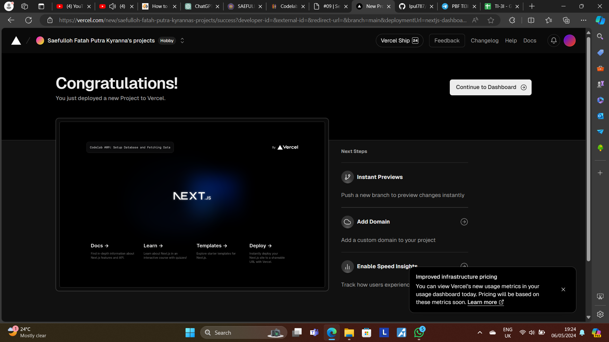
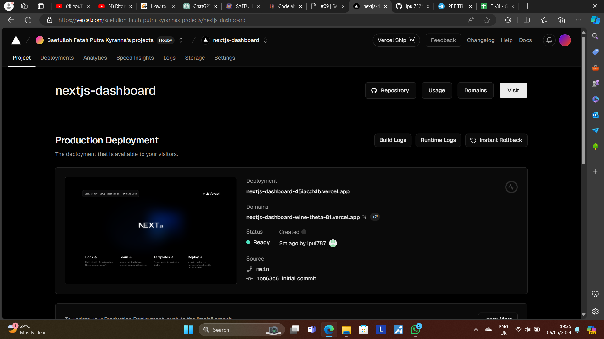
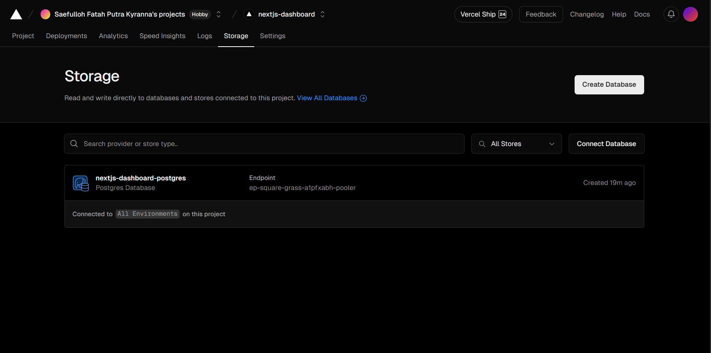
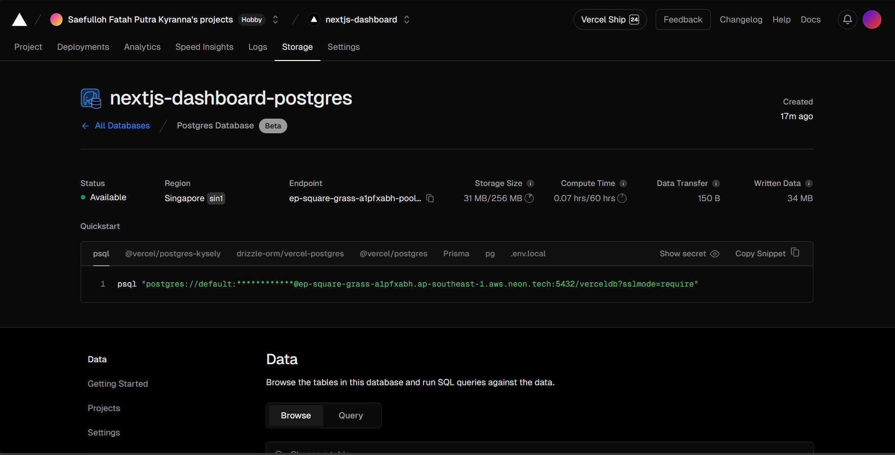
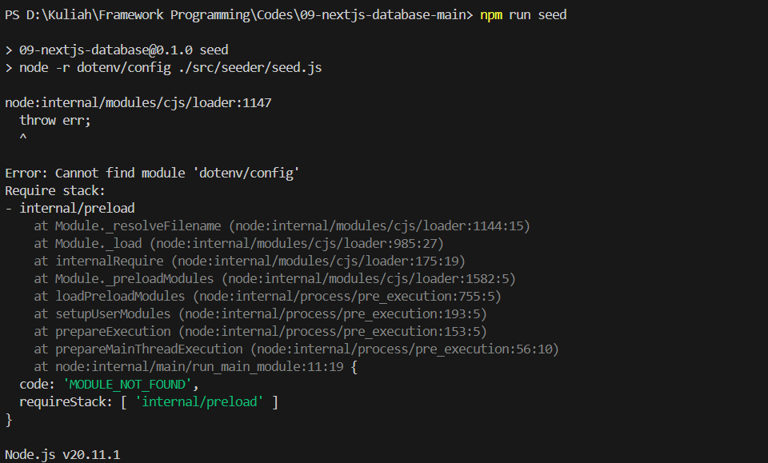
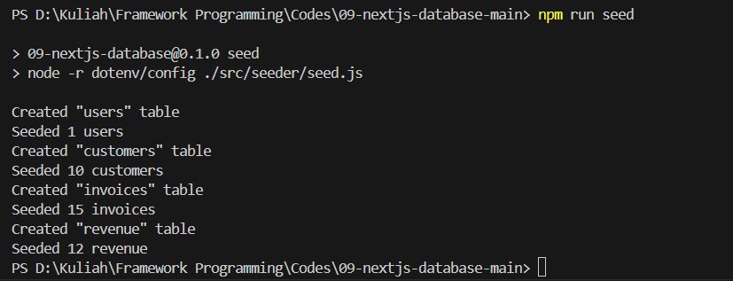
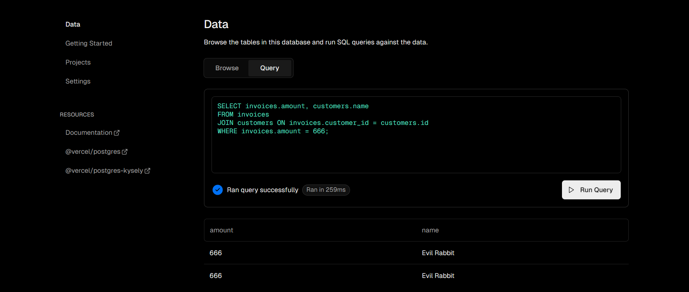
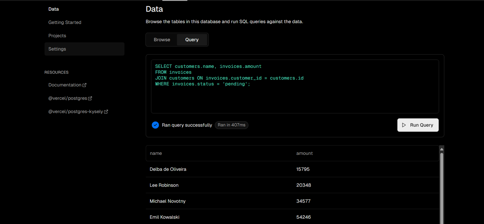
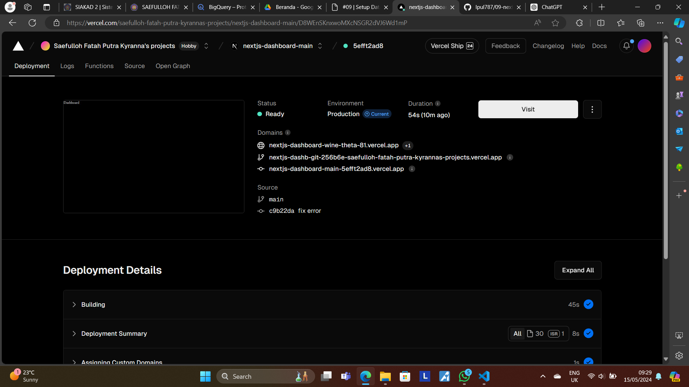
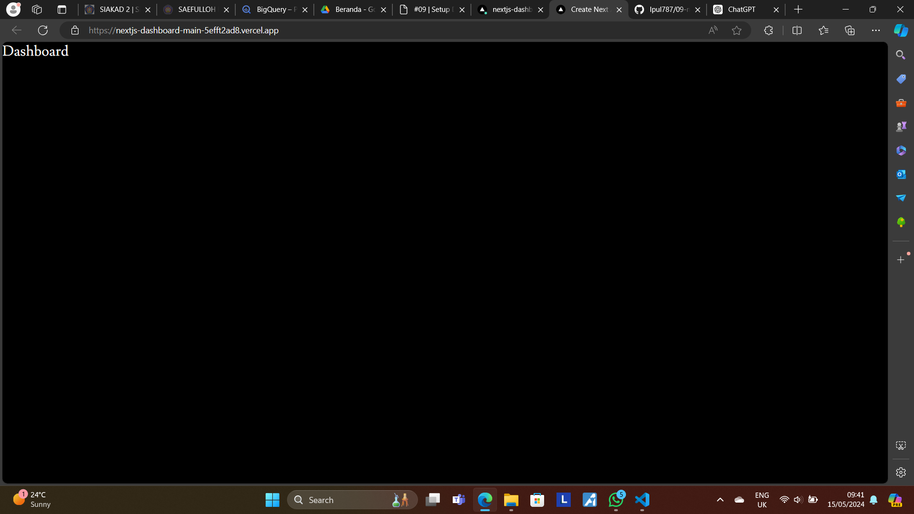

This is a [Next.js](https://nextjs.org/) project bootstrapped with [`create-next-app`](https://github.com/vercel/next.js/tree/canary/packages/create-next-app).

## Getting Started

First, run the development server:

```bash
npm run dev
# or
yarn dev
# or
pnpm dev
# or
bun dev
```

Open [http://localhost:3000](http://localhost:3000) with your browser to see the result.

You can start editing the page by modifying `app/page.tsx`. The page auto-updates as you edit the file.

This project uses [`next/font`](https://nextjs.org/docs/basic-features/font-optimization) to automatically optimize and load Inter, a custom Google Font.

## Practicum Report

|  | Framework Based Programming 2024 |
|--|--|
| NIM |  2141720067|
| Nama |  Saefulloh Fatah Putra Kyranna |
| Kelas | TI - 3I |

## Answer of Question No. 1

Output of Deployment: 



Deployment Dashboard: 



## Answer of Question No. 2

In this practicum, we have learned about how to make a database on Vercel and connect it to our workspace. We could achieve this by using .env.local code snippet and paste it to our project directory. 

Database Generated on Vercel: 





## Answer of Question No. 3

In this practicum, we have learned about seeding the data into the configured database. During the seeding process, there are some errors encountered such as missing dotenv, bcrypt, and data.js modules. However, this could be resolved by installing the necessary modules and changing the directory of the data.js file in the seed.js file. 

Initial output: 



Final output after fixes: 



## Answer of Question No. 4

In this practicum, we learned to query on the database on vercel. We also create a query of our own. 





## Answer of Question No. 5

In this practicum, we have learned about how to deploy our app from GitHub to Vercel. Before that, we have redesigned our app so that it will conform to the atomic web design to ensure modularity. 

[Deployment link](https://nextjs-dashboard-wine-theta-81.vercel.app/)

Vercel Dashboard: 



Output: 


